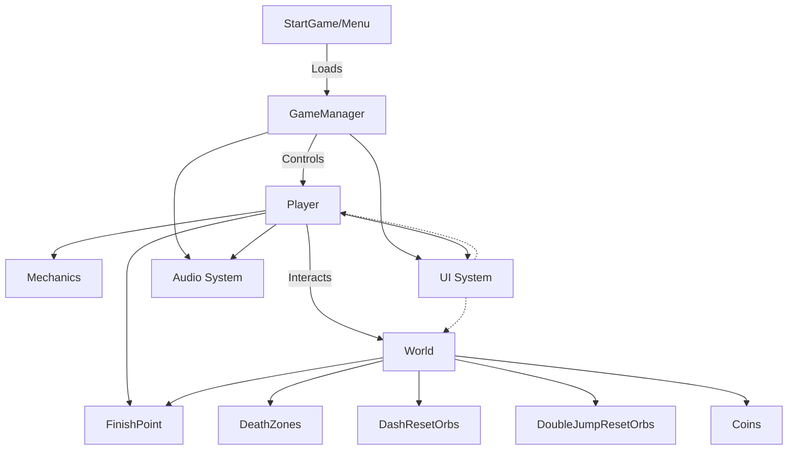

wish-celeste
---
Čia rasite programų sistemos inžinerijos modulio, technologinio projekto dokumentacija.

Komandos nariai:
---
Povilas Jankauskas 

Benas Sokolovas

Mantas Uscila

Projekto aprašymas:
---
Wish celeste - tai 2D žaidimas, skirtas vienam žaidėjui. Žaidimo tikslas - pereiti visus lygius ir surinkti kuo daugiau monetų. Žaidimo kuryboje fokusavomės į kuo įvairesnes mechanikas, kad pakelti įgudžių lubas (skill-ceiling) Žaidimas yra skirtas Windows operacinėms sistemoms.

Techninis aprašymas:
---
Žaidimui realizuoti buvo naudotas žaidimų kūrimo variklis „Unity". Projekto užduočių valdymui naudota „Jira“ aplinka,o bedravimui tarp komandos narių „Discord“ ir „Messenger“ platformos.

Pagrindinis projekto techninis reikalavimas, sukurti veikiantį 2D žaidimą, kuriamve žaidėjas gali įvairiai manevruoti ore. 

Pagrindinės įgyvendintos užduotys:

Sukurta jump ir double jump mechanikos

Sukurta air-dash mechanika

Sukurti lygiai, kuriuose žaidėjas pilnai gali ištestuoti esančias mechanikas

Sukurtas air-dash reset orb ir jump reset orb

Sukurtas mirties efektas

Architektūra

**Komponentų pastabos:**

- **GameManager (Žaidimo valdytojas):** Valdo žaidimo būseną ir scenų perjungimą.
- **Player (Žaidėjas):** Pagrindinė logika judėjimui, mechanikoms, atsiradimui iš naujo ir sąveikai su pasaulio objektais.
- **World (Pasaulis):** Tilemap'ai ir interaktyvūs žaidimo objektai (monetos, atstatymo orbai, mirties zonos, finišas).
- **Mechanics (Mechanikos):** Šuolio, dvigubo šuolio, oro šuolio bei atstatymo logika (įgyvendinta Player skripte).
- **UI System (Vartotojo sąsajos sistema):** Sukurta naudojant Unity UI/TextMesh Pro, rodo žaidimo HUD, meniu, kt.
- **Audio System (Garso sistema):** Valdo muziką ir garso efektus.
- **StartGame/Menu (Pagrindinis meniu):** Pagrindinis meniu ir žaidimo pradžios logika.
- **FinishPoint (Finišo taškas):** Aptinka, kai žaidėjas pasiekia lygio pabaigą ir inicijuoja progresą.

---
